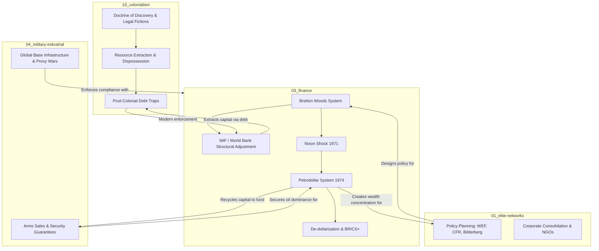

# Evidence Locker — Concept Map & Interconnections

This document visualizes the systemic connections between the major pillars of the Evidence Locker archive. 

## The Global Power Architecture

## Key Pathways & Flows

1. **Bretton Woods → Petrodollar → MIC Funding**: The U.S. agreed to underwrite Saudi security (fueling the military-industrial complex) in exchange for exclusive oil pricing in dollars. This petrodollar recycling forces global demand for U.S. debt, allowing the U.S. to run massive deficits without immediate hyperinflation, which in turn directly funds ongoing military expansion.
2. **Colonialism → Financialization**: Direct resource extraction (classic colonialism) evolved into indirect extraction via sovereign debt (structural adjustment programs by the IMF/World Bank). The tools changed from military occupation to financial coercion, but the net resource flow (Global South to Global North) remains remarkably similar.
3. **Financial Hegemony → Elite Networks**: The architects of these systems form a revolving door across policy think tanks, central banks, and corporate boards. They insulate these mechanisms from democratic oversight, defining the bounds of "acceptable" economic policy globally.
4. **Petrodollar → De-dollarization**: The weaponization of the dollar system (via sanctions and reserve freezing) accelerates the move toward alternative financial architectures like BRICS+, threatening the liquidity engine that sustains the MIC.
